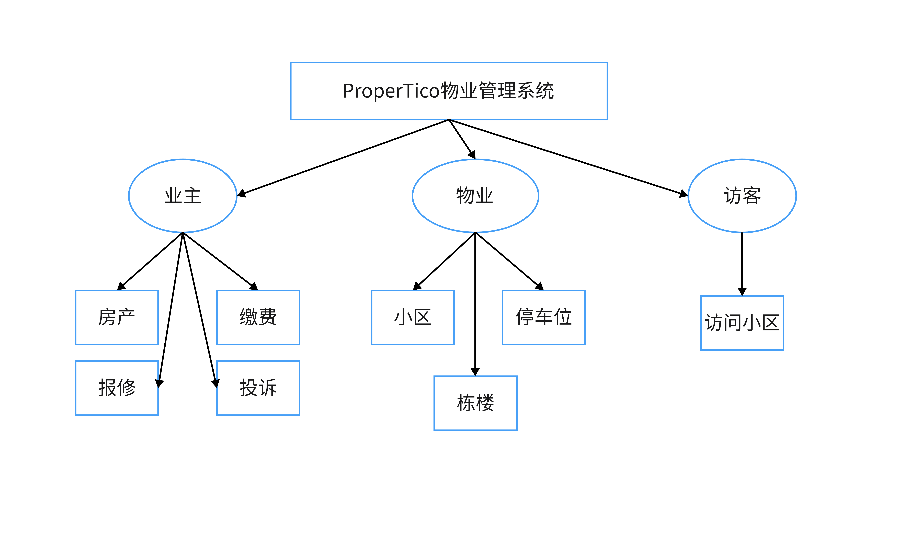

    
    <h2 align="center">需求文档</h2>

    <h2 align="center">Unified Modeling Language</h2>

## 用户（包含安全框架）

#### 用户

1. 注册
2. 登录
3. 用户找回密码
4. 人机交互验证：Google安全验证
5. 短信验证
6. Token授权
7. 报事报修管理
8. 缴费管理
9. 访客录入
10. 车位查询

## 管理业务

#### 物业管理

1.  小区管理：新增小区，小区列表展示，小区信息修改，小区移除;
2.  房产管理：新增房产，房产列表展示，房产信息修改，房产移除
3.  楼栋管理：新增楼栋，楼栋列表展示，楼栋信息修改，楼栋移除;
4.  业主信息管理：业主注册，业主列表，业主信息修改，业主移除;
5.  停车位管理：车位管理，车位使用管理;
6.  服务管理：报修管理，投诉管理，缴费管理;
